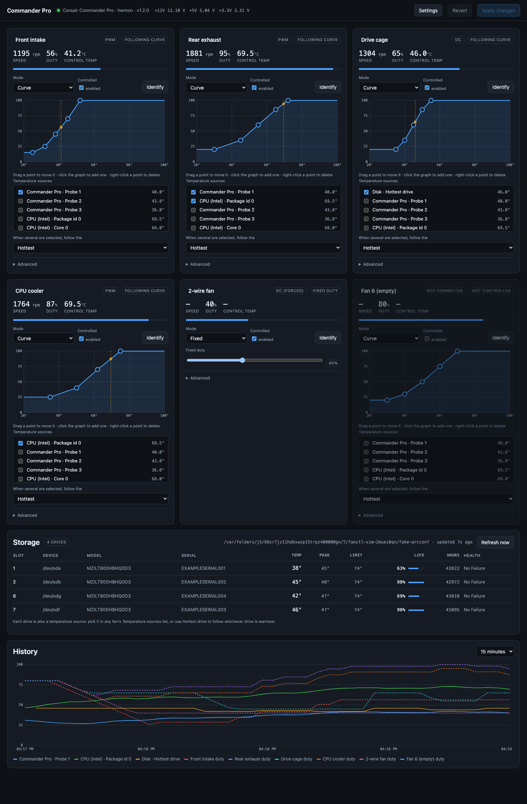

# Corsair Fan Control for Proxmox

[](https://github.com/rph81/corsair-fanctl/actions/workflows/test.yml)
[](LICENSE)
[](https://www.python.org/)

*Package and service name: `corsair-fanctl`*

Fan control for the **Corsair Commander Pro**, with temperature curves and a web
UI, built to run on a Proxmox VE host. It does what iCUE does for fans — and
only fans. There is no lighting support and none is planned.

Crucially, it can drive fans from **drive temperatures behind an Adaptec /
Microsemi SmartHBA or SmartRAID controller** (read via `arcconf`) — disks on a
SAS HBA are invisible to Linux hwmon, so no other fan tool can see them. Point
your drive-cage fan at the hottest disk in the cage and it will actually track
it. Developed against an **HP Microsemi/Adaptec SmartHBA 2100-4i4e**.



- Six fan channels, each independently in **curve**, **fixed** or **off** mode.
- Curves can follow **any** temperature the host can see: the Commander Pro's
  four probes, CPU package temperature, NVMe drives, HDDs — anything that shows
  up under `/sys/class/hwmon`.
- **SAS/SATA drives behind an Adaptec/Microsemi HBA too**, read via `arcconf`,
  shown in a live Storage panel and usable as fan curve sources.
- A channel can watch several sensors at once and follow the hottest of them.
- Hysteresis, asymmetric ramp rates and a spin-up kick, so fans settle instead
  of hunting.
- Handles 4-pin PWM and 3-pin DC fans automatically, and 2-wire DC fans with a
  one-click override.
- Failsafe and over-temperature behaviour that is on by default.
- Dark and light themes, a pickable accent colour and saved favourites.
- No agent inside your VMs, no cloud account, no Windows.

## Requirements

- A Proxmox VE 8 or 9 host (or any Debian/Ubuntu box) — PVE 9 ships Debian 13
  and kernel 6.14, PVE 8 ships Debian 12 and kernel 6.8. Both include the
  `corsair-cpro` driver this uses.
- Python 3.9+. **No pip packages are required.** The daemon is pure standard
  library; `liquidctl` is optional and only used as a fallback.
- The Commander Pro plugged into the host over USB.

## Install

On the Proxmox host, as root. With git:

```bash
git clone https://github.com/rph81/corsair-fanctl && cd corsair-fanctl && ./install.sh
```

Or download the release tarball, if git is not installed:

```bash
curl -fsSL -o corsair-fanctl.tar.gz \
  https://github.com/rph81/corsair-fanctl/releases/latest/download/corsair-fanctl-1.3.0.tar.gz
tar -xzf corsair-fanctl.tar.gz && cd corsair-fanctl-1.3.0 && ./install.sh
```

To verify the download first (the checksum is published alongside it):

```bash
curl -fsSL -O https://github.com/rph81/corsair-fanctl/releases/latest/download/corsair-fanctl-1.3.0.tar.gz.sha256
sha256sum -c corsair-fanctl-1.3.0.tar.gz.sha256
```

Then open `http://<host-ip>:8899/`.

The installer copies the program to `/opt/corsair-fanctl`, writes a default
config to `/etc/corsair-fanctl/config.json`, and enables the
`corsair-fanctl` systemd service.

To also set up the USB HID fallback (only needed if your kernel has no
`corsair-cpro` module):

```bash
./install.sh --with-liquidctl
```

To remove it: `./uninstall.sh` (add `--purge` to delete the config too).

### Autostart and service management

The installer enables the service, so it comes back on every boot with no
action from you. To confirm, and for the usual day-to-day commands:

```bash
systemctl is-enabled corsair-fanctl   # -> enabled
systemctl status corsair-fanctl
systemctl restart corsair-fanctl
journalctl -u corsair-fanctl -f
```

The unit is deliberately **not** ordered after `network-online.target`. Fan
control should not wait for networking: the control loop starts before the
HTTP server, and if the port is busy or `http.bind` is pinned to an address
that does not exist yet, the daemon keeps driving the fans and retries the bind
every 5 s (using `IP_FREEBIND`, so a not-yet-configured address binds anyway).
Gating on the network would leave the fans unmanaged — sitting at the 80%
shutdown failsafe — for however long `network-online.target` takes.

`StartLimitIntervalSec=0` disables systemd's start-rate limit, so a fan
controller can never be parked in a failed state and stop managing the fans.

At boot the Commander Pro may enumerate after the daemon starts; that is
expected. The control loop retries the connection every 5 seconds and the UI
shows `device not connected` until it succeeds.

## First run

**On a fresh install every fan runs at 80%.** That is deliberate: no fan has a
temperature source assigned yet, so each one falls back to the failsafe duty.
The UI shows `NO SENSOR SELECTED → FAILSAFE` on those channels.

To fix it, for each fan you actually use:

1. Rename it to something you will recognise ("Front intake", "Drive cage").
2. Tick one or more **temperature sources**.
3. Shape the curve by dragging its points.
4. Press **Apply changes**.

Use the **Identify** button to find out which physical fan is on which channel —
it runs that channel at 100% for five seconds.

To see the sensor ids from a shell:

```bash
python3 -m fanctl --config /etc/corsair-fanctl/config.json --list-sensors
```

## How control works

Curves are evaluated **in software**, once per poll interval (2 s by default),
and the resulting duty is written to the device. The Commander Pro's own
firmware curves are not used. That is what allows a fan to follow a CPU or NVMe
temperature the device itself cannot see.

Each tick, per channel:

1. Read every selected sensor and combine them (**hottest**, average or coolest).
2. Apply **hysteresis**: the control temperature only moves once the reading has
   shifted by at least this much. Stops a sensor flickering between 44 and 45
   degrees from being audible. Default 1.5 °C.
3. Look up the duty on the curve. Below the first point and above the last, the
   curve is flat.
4. Clamp to **min/max duty**; if **stop below** is set and the temperature is
   under it, stop the fan completely (zero-RPM).
5. Apply **ramp** limits — by default 25%/s up and 3%/s down, so the fan reacts
   quickly to heat and backs off gently.
6. If the fan is starting from a standstill, hold the **spin-up duty** for the
   spin-up time first. DC fans will not reliably start at a low duty.

### Safety behaviour

| Situation | What happens |
|---|---|
| No sensor selected for a channel | Failsafe duty (default 80%) |
| Selected sensors all disappear | Failsafe duty, channel flagged in the UI |
| Any one of a channel's sensors reaches the emergency temperature (default 85 °C), regardless of the mix setting | That channel jumps straight to the emergency duty, ignoring hysteresis and ramp limits |
| The service stops or the host shuts down | All channels set to the failsafe duty |
| The device unplugs or re-enumerates | Reconnect is retried every 5 s; fans hold their last duty meanwhile |
| The service crashes | The Commander Pro holds the last duty it was given |
| The config file cannot be parsed | It is moved aside as `config.json.corrupt-<time>`, the daemon starts with defaults (every fan at the failsafe duty) and the UI shows a banner |
| The web UI port cannot be bound | Fan control runs anyway; the bind is retried every 5 s |

Emergency response is **per channel**, based on that channel's own sensors. If
you want a CPU over-temperature to spin up every fan, add the CPU sensor to
every fan.

> The last row is worth internalising: these fan channels are driven by the
> Commander Pro, not your motherboard. If this service is not running, nothing
> is adjusting them — they simply stay wherever they were last told to be. That
> is why stopping the service raises the fans to the failsafe duty rather than
> lowering them.

## The two backends

**hwmon** (default, preferred). Uses the in-kernel `corsair-cpro` driver at
`/sys/class/hwmon/hwmonN`: reads `fan*_input` and `temp*_input`, writes
`pwm[1-6]`. No USB library, no contention with the kernel driver, and it
survives suspend/resume cleanly.

**liquidctl** (fallback). Raw USB HID through the `liquidctl` package. Used
when the kernel module is unavailable. Note that `liquidctl` must run
`initialize()` before any duty write is accepted — the daemon does this
automatically on every connect, including after a reconnect.

`auto` (the default) tries hwmon first, then liquidctl. You can pin a backend in
the UI under **Settings → Device backend**.

## Configuration file

`/etc/corsair-fanctl/config.json` is the source of truth and is safe to edit by
hand — the daemon picks up external changes on its next poll, and the web UI
adopts them as long as you have no unsaved edits.

```jsonc
{
  "http": {
    "bind": "0.0.0.0",         // needs a service restart to take effect
    "port": 8899,
    "auth_token": null         // set a string to require a token
  },
  "control": {
    "backend": "auto",         // auto | hwmon | liquidctl
    "interval": 2.0,           // seconds between control ticks
    "failsafe_duty": 80,       // 20-100
    "emergency_temp": 85.0,
    "emergency_duty": 100,     // 50-100, and never below failsafe_duty
    "apply_failsafe_on_exit": true,
    "reassert_seconds": 30.0   // re-send duties periodically
  },
  "history": { "seconds": 3600 },
  "storage": { "enabled": true, "controller": 1, "interval": 30.0 },
  "ui": { "theme": "dark", "accent": "#4aa3ff", "favorites": [] },
  "fans": [
    {
      "index": 1,
      "name": "Front intake",
      "enabled": true,
      "mode": "curve",                     // curve | fixed | off
      "fixed_duty": 50,
      "sensors": ["cpro:temp1"],           // see --list-sensors
      "mix": "max",                        // max | avg | min
      "curve": [[30, 20], [40, 30], [50, 50], [60, 75], [70, 100]],
      "min_duty": 20,
      "max_duty": 100,
      "hysteresis": 1.5,
      "ramp_up": 25.0,                     // percent per second
      "ramp_down": 3.0,
      "stop_below": null,                  // °C, or null to never stop
      "spin_up_duty": 60,
      "spin_up_ms": 800,
      "force_mode": null                   // null, "dc" or "pwm"
    }
  ]
}
```

Everything written through the API or the UI is range-checked and clamped, so a
bad value cannot put the daemon into a state where it stops controlling fans.

`PUT /api/config` **merges** onto the running config rather than replacing it
wholesale, and fans are merged per channel. A request naming only one section
changes exactly what it mentions — it will not silently reset the five fan
curves it did not talk about. Lists inside a fan (`sensors`, `curve`) are still
replaced outright, so they can be emptied or reshaped.

### Sensor ids

| Form | Meaning |
|---|---|
| `cpro:temp1` … `cpro:temp4` | The Commander Pro's own probes |
| `hwmon:coretemp:temp1` | Intel CPU package |
| `hwmon:k10temp:temp1` | AMD CPU |
| `hwmon:nvme:temp1`, `hwmon:nvme#2:temp1` | NVMe drives, in probe order |
| `hwmon:drivetemp:temp1` | SATA drive (needs the `drivetemp` module) |
| `arcconf:1:slot3` | Drive in slot 3 of Adaptec controller 1 |
| `arcconf:1:max` | The hottest drive on that controller |

Ids are built from the *driver name*, not the `hwmonN` number, because the
kernel does not guarantee stable hwmon numbering across reboots.

## Fan types: PWM, 3-pin DC, and 2-wire

The Commander Pro drives each channel either by PWM (4-pin fans) or by varying
the supply voltage (DC). It auto-detects which on connect, and the type is shown
as a tag on each fan card. Nothing needs configuring for the common cases:

| Fan | Detection | Speed control | RPM readout |
|---|---|---|---|
| 4-pin PWM | automatic | yes | yes |
| 3-pin DC | automatic | yes (voltage) | yes |
| **2-wire DC** (red/black only) | **often reads as empty** | yes, once forced | **never** - no tach wire |

A 2-wire fan has power and ground and nothing else. With no tachometer wire
there is no signal for the controller to sense, so the channel frequently
reports as unpopulated and no software - this or iCUE - will drive it until the
mode is set by hand. And it will *never* report RPM; a blank speed readout on
such a channel is physically expected, not a fault.

To force a channel, open its **Advanced** section and set **Fan type** to
`DC - 3-pin or 2-wire`. The daemon reconnects and reprograms the channel.

**Forcing a mode that auto-detection rejected needs the liquidctl backend.** The
`corsair-cpro` kernel driver only exposes `pwmN` for channels it believes are
populated, and it has no interface for overriding the fan mode at all - so on
the hwmon backend there is simply nothing to write to. The UI says so on the
affected card rather than failing quietly. To fix it:

```bash
./install.sh --with-liquidctl
```

Then set **Settings -> Device backend** to `liquidctl` and the daemon will
reconnect. If the kernel module is bound, liquidctl would otherwise *silently
discard* the fan-mode request (it only logs a warning), so the daemon switches
to direct USB access automatically whenever any channel is forced. Where the two
fight over the device, blacklist the module:

```bash
echo "blacklist corsair-cpro" > /etc/modprobe.d/corsair-cpro-blacklist.conf
rmmod corsair_cpro && systemctl restart corsair-fanctl
```

Because a 2-wire fan reports no RPM, give it a generous **min duty** and
**spin-up**: DC fans typically need 30-40% to start, and you have no tachometer
to tell you it stalled. Set the curve so it never drops below a duty you have
confirmed by ear.

## SAS/SATA drives behind an Adaptec HBA

Drives on a SAS HBA are invisible to Linux hwmon — the kernel sees SCSI devices,
not thermal sensors — so the only way to get their temperature is to ask the
controller. If `arcconf` is installed, the daemon runs

```
arcconf getconfig <controller> PD
```

on a slow schedule (30 s by default), scrapes out each drive's temperature, and
publishes them as ordinary sensors. They appear in the **Storage** panel of the
web UI and in every fan's temperature source list, so a drive-cage fan can
follow the drives it is actually cooling:

```bash
curl -X POST -H 'Content-Type: application/json' localhost:8899/api/fan/3 \
  -d '{"name":"Drive cage","sensors":["arcconf:1:max"],
       "curve":[[35,20],[40,35],[45,60],[50,85],[55,100]]}'
```

**Sensor ids are keyed on the physical slot** (`arcconf:1:slot3`), not on
`/dev/sdX`. Kernel device letters are assigned in discovery order and can move
between boots; "slot 3" stays the bay you actually pointed a fan at. Drives
without a reported slot fall back to `arcconf:1:c<channel>d<device>`.

The Storage panel also shows peak temperature, the controller's own threshold,
remaining life, power-on hours and S.M.A.R.T. state — the panel highlights a
drive amber at 80% of its threshold and red at 90%.

### Configuration

```jsonc
"storage": {
  "enabled": true,
  "provider": "arcconf",
  "command": "arcconf",   // file-only, see the warning below
  "controller": 1,
  "interval": 30.0,       // seconds between polls; arcconf is slow
  "timeout": 20.0,
  "stale_after": 120.0    // drop the sensors if polling stops working
}
```

If `arcconf` is not installed, or the controller stops answering, the poll fails
and after `stale_after` the drive sensors are **removed from the catalog**. Any
fan bound to one then reports `sensor lost → failsafe` and goes to the failsafe
duty, rather than running on a temperature from ten minutes ago. `stale_after`
is automatically raised to at least `2 × interval + 30 s` so the sensors cannot
flap in and out between polls.

> **`storage.command` cannot be changed through the web UI or API.** It names a
> binary the daemon executes as root, so accepting it over HTTP would turn any
> request that reaches the API into arbitrary root code execution. The running
> value always wins; change it by editing the config file and restarting. Every
> other storage setting is safe to change from the UI.

Only `arcconf` is implemented today. Other controllers (`storcli`, `perccli`,
`smartctl` for plain SATA) would each need their own parser.

## Appearance

**Settings -> Theme** switches between Dark, Light and System (which follows the
browser/OS preference and updates live if it changes).

**Accent colour** has eight presets plus a full colour picker for anything else.
Changes apply instantly - no Apply needed - and save to the server, so the look
follows you to any browser rather than living in one machine's localStorage. Up
to **10 favourite colours** can be saved; hover a favourite to remove it.

In the **History** chart, each legend entry is a toggle: click a series to
hide or show it, shift-click to see it on its own, and **Show all** to bring
everything back. That selection is remembered per browser, not on the server.

Chart series colours are deliberately *not* tied to the accent: a categorical
palette needs its colours distinguishable from each other, which is a different
problem from picking a brand colour. The chart does swap to a darker palette in
light mode so the lines stay readable on white.

```jsonc
"ui": {
  "theme": "dark",          // dark | light | system
  "accent": "#4aa3ff",      // #rrggbb, validated server-side
  "favorites": ["#3fb950"]  // max 10
}
```

## Access control

The UI is unauthenticated by default, which is fine on a management VLAN and
not fine on anything routable. To require a token:

```bash
python3 - <<'PY'
import json, secrets
path = "/etc/corsair-fanctl/config.json"
cfg = json.load(open(path))
cfg["http"]["auth_token"] = secrets.token_urlsafe(24)
json.dump(cfg, open(path, "w"), indent=2)
print("token:", cfg["http"]["auth_token"])
PY
systemctl restart corsair-fanctl
```

Then open `http://<host>:8899/?token=<token>` once; the browser remembers it.
API clients can send `Authorization: Bearer <token>` or `X-Auth-Token`.

To bind to localhost only and reach it over an SSH tunnel, set
`http.bind` to `127.0.0.1` and restart, then:
`ssh -L 8899:127.0.0.1:8899 root@<host>`.

## HTTP API

All routes are JSON. `/healthz` is the only one that skips authentication.

`POST` and `PUT` bodies **must** be sent with `Content-Type: application/json`,
and a request carrying an `Origin` header from another site is refused with
403. That is what stops a random web page open in a browser on your LAN from
turning the fans off through the unauthenticated API; the web UI and `curl`
with the header shown below are unaffected.

| Method | Path | Purpose |
|---|---|---|
| `GET` | `/api/state` | Live snapshot: temps, RPM, duties, per-channel reason, sensor catalog, config |
| `GET` | `/api/history?since=<epoch>&points=<n>` | Time series for charts |
| `GET` | `/api/config` | Current config |
| `PUT` | `/api/config` | Replace the config (normalised, clamped, persisted) |
| `POST` | `/api/fan/<1-6>` | Patch one fan's settings |
| `POST` | `/api/identify/<1-6>` | Run a channel at a duty briefly: `{"duty":100,"seconds":5}` |
| `POST` | `/api/storage/refresh` | Poll the storage controller immediately |
| `POST` | `/api/reconnect` | Drop and re-open the device |

```bash
# Put the drive-cage fan on a fixed 35%
curl -X POST -H 'Content-Type: application/json' localhost:8899/api/fan/3 -d '{"mode":"fixed","fixed_duty":35}'

# Point fan 2 at both a probe and the CPU, following whichever is hotter
curl -X POST -H 'Content-Type: application/json' localhost:8899/api/fan/2 \
  -d '{"sensors":["cpro:temp1","hwmon:coretemp:temp1"],"mix":"max"}'
```

## Running it on the host, not in a container

Install this on the **PVE host itself**. Fan control needs to write to
`/sys/class/hwmon/*/pwm*` (or open `/dev/hidraw*`), and neither works cleanly
from an unprivileged LXC: sysfs is mounted read-only inside the container, and
passing the raw HID device through means giving the container hardware access
you probably do not want. The daemon is a single Python process using a few MB
of RAM — it is a poor trade to containerise it.

If you want the UI reachable from a container or reverse proxy anyway, proxy to
the host's port rather than moving the daemon.

## Troubleshooting

**The UI says "device not connected".**
Check that the device is visible and the module is loaded:

```bash
lsusb | grep 1b1c            # 1b1c:0c10 is the Commander Pro
lsmod | grep corsair         # corsair_cpro should be listed
modprobe corsair-cpro
ls -l /sys/class/hwmon/*/name | xargs -n1 dirname 2>/dev/null
grep -l corsair-cpro /sys/class/hwmon/*/name
```

**Fans are stuck at 80%.** That is the failsafe. Either no sensor is assigned to
that channel, or its sensors stopped reading. The channel's badge in the UI says
which.

**A fan reads 0 RPM but is spinning** (or the reverse). Three-pin DC fans report
RPM only when the channel is set to DC mode. The Commander Pro auto-detects this
at initialisation — unplug/replug the fan and restart the service to re-detect.

**A fan will not start at low duty.** Raise **spin-up duty** or **spin-up time**
in that channel's Advanced section, or raise **min duty**. DC fans typically
need 30–40% to start even if they will keep running at 15%.

**The Storage panel is missing entirely (no panel, not even an error).** The
daemon is running older code — the panel only exists from v1.1.0. Check what is
actually running, which the header also shows next to the device name:

```bash
curl -s localhost:8899/api/state | python3 -c "import json,sys; print(json.load(sys.stdin).get('version','pre-1.1.0'))"
systemctl restart corsair-fanctl
```

**The Storage panel says "unavailable".** Check that `arcconf` is on `PATH` and
answers as root:

```bash
which arcconf && arcconf getconfig 1 PD | grep -c "Current Temperature"
```

The daemon looks for it on the service `PATH` (which systemd keeps minimal) and
in the usual Adaptec locations — `/usr/Arcconf`, `/usr/StorMan`, `/opt/arcconf`
and friends. The path it settled on is shown in the Storage panel header. If it
lives somewhere else, set the full path in `storage.command` in the config file
(not from the UI — see above) and restart. Set
`storage.enabled: false` to hide the panel entirely.

**Changes to `bind` or `port` did nothing.** Those are read at startup:
`systemctl restart corsair-fanctl`.

**Logs:** `journalctl -u corsair-fanctl -f`

## Development

`tools/devsim.py` runs the whole daemon against a simulated Commander Pro — a
fake sysfs tree plus a thermal model where temperatures actually respond to the
duties the control loop writes. No hardware needed:

```bash
python3 tools/devsim.py --port 8899    # then open http://127.0.0.1:8899/
python3 tools/selftest.py              # curve, config and control-loop tests
```

## Layout

```
fanctl/
  backends.py    hwmon and liquidctl transports, auto-selection
  config.py      defaults, normalisation/clamping, atomic save
  controller.py  the control loop; owns the device
  curves.py      interpolation, hysteresis, slew limiting, spin-up
  sensors.py     hwmon temperature discovery, sensor mixing
  arcconf.py     Adaptec/Microsemi drive temperatures (parser + poller)
  history.py     in-memory ring buffer for the charts
  httpd.py       stdlib HTTP server, JSON API, static files
web/             single-page UI: no framework, no build step
tools/           devsim.py (simulator), selftest.py, fixtures/
systemd/         the service unit
docs/            screenshot
.github/         CI workflow and issue templates
```

See [CONTRIBUTING.md](CONTRIBUTING.md) for how to run the tests without
hardware, and [CHANGELOG.md](CHANGELOG.md) for version history.

## Licence

MIT.
